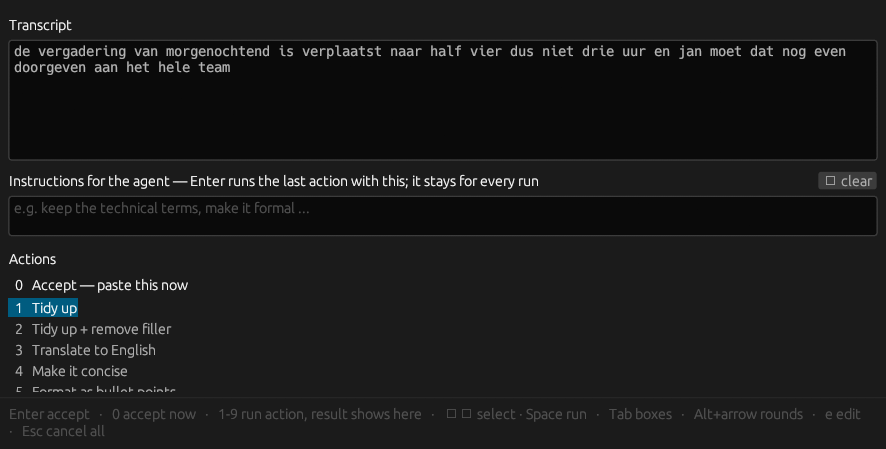

# voxtype-review

An extensible menu for [Voxtype](https://github.com/peteonrails/voxtype)
dictation: instead of raw speech landing in your document, a popup opens with
**your transcript as an editable menu** — fix it, enhance it, translate it,
reformat it, or send it straight through. All keyboard, all shortcuts.



- **Translate strip** — one click (or arrow+Space) to Dutch, English or German at the top of the menu
- **`0`** — paste it now, untouched
- **`1`–`9`** — run an action from the menu: *Tidy up*, *Remove filler*,
  *Translate*, *Make it concise*, *Bullet points* … extend the menu with any
  shell pipeline you like
- **The result shows in the menu first** — you read what the action did to
  your words *before* anything is committed; `Enter` pastes it, `Esc` gives
  back your original
- **An instruction box for the agent** — "keep it formal", "remove the
  repetitions", spoken (`Ctrl+I`) or typed; it stays across rounds, and
  `Enter` re-runs the last action with it applied
- **`Alt+←/→`** — step back through every round; nothing is ever lost

Built entirely on Voxtype's supported `post_process` hook — no fork, no
patches, survives every upstream release.

## What it gives you

- **Edit before insert** — the popup shows the raw transcript in an editable
  box; `Enter` commits what the box holds; `Esc` aborts — nothing lands at all
- **`0` — instant paste** — skip review entirely, paste the raw text now
- **Configurable actions** (`1`–`9`) — tidy up, remove filler, translate,
  reformat: anything a shell pipeline can do (local LLM, HTTP API, jq …)
- **Show-then-commit** — an action runs *in the popup* and its result
  replaces the shown text; nothing is pasted until you accept
- **Agent iteration loop** — an instruction box whose contents are prepended
  to every action run; type or **speak** extra steering (`Ctrl+I`), press
  `Enter` to re-run, refine as many rounds as you like
- **Round history** — `Alt+←/→` steps back and forward through every
  intermediate result; `Esc` still reaches the original
- **Keyboard-first** — `Tab` cycles transcript → instructions → actions;
  arrow keys + `Space` select and run; the mouse is optional
- **Focus-safe** — on commit, focus returns to the window you dictated from
- **CPU/GPU transparent** — actions call whatever your pipelines call;
  transcription stays in Voxtype

## Install

```sh
git clone https://github.com/DimitriGeelen/voxtype-review
cd voxtype-review
cargo build --release
./install.sh          # builds, installs to ~/.local/bin, wires the hook
```

`install.sh` appends a marked block to `~/.config/voxtype/config.toml`:

```toml
[output.post_process]
command = "/home/you/.local/bin/voxtype-review"
timeout_ms = 600000   # a human reading their own words, not a model answering
trim = false          # the hook owns whitespace
```

Remove the block (or run `./install.sh --uninstall`) to go back to plain
dictation. Voxtype falls back to the raw transcript if the hook is killed at
the timeout or exits non-zero — a review gate can never eat your dictation.

## Terminal targets

Terminal emulators paste with `Ctrl+Shift+V`, not `Ctrl+V`. Point
`output.paste_keys` at the chord your targets actually bind:

```toml
[output]
paste_keys = "ctrl+shift+v"
```

## Actions

Actions live in `~/.config/voxtype-review/config.toml` and are plain shell
pipelines. The transcript arrives on stdin; the popup takes back whatever the
pipeline prints on stdout:

```toml
[[actions]]
label       = "Translate to English"
key         = "3"
timeout_ms = 110000
command     = "jq -Rs --arg m gemma4:latest --arg p 'Translate this text into English. …' \
               '{model:$m, prompt:($p+\"\\n\\n\"+.), stream:false, keep_alive:\"30m\"}' \
               | curl -sf http://localhost:11434/api/generate -d @- | jq -r '.response'"
```

Notes learned the hard way:

- **`keep_alive` matters** — a local LLM unloads after ~5 idle minutes, and
  every action after a pause becomes a cold start
- **Empty output is failure** — the popup treats a pipeline that prints
  nothing as a failed action and keeps your text
- **LLMs echo instructions** — when the popup prepends the operator's
  instruction block it also tells the model never to repeat those
  instructions as content

## Licence

MIT — see [LICENSE](LICENSE).
